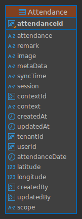

# Database Schema

## Entities -Attendance Management

### Table: Attendance

| **Column Name**    | **Data Type**            | **Details**                                                                                     |
|---------------------|--------------------------|-------------------------------------------------------------------------------------------------|
| `attendance`        | `varchar`               | **NOT NULL**, must be one of (`present`, `absent`, `on-leave`)                                  |
| `remark`            | `varchar(255)`          | Optional                                                                                       |
| `image`             | `varchar(500)`          | Optional                                                                                       |
| `metaData`          | `varchar`               | Optional                                                                                       |
| `syncTime`          | `varchar`               | Optional                                                                                       |
| `session`           | `varchar`               | Optional                                                                                       |
| `contextId`         | `uuid`                  | **NOT NULL**                                                                                   |
| `context`           | `varchar(255)`          | **NOT NULL**                                                                                   |
| `createdAt`         | `timestamptz`           | Defaults to current timestamp                                                                  |
| `updatedAt`         | `timestamptz`           | Defaults to current timestamp                                                                  |
| `attendanceId`      | `uuid`                  | **NOT NULL**, Primary Key, defaults to `gen_random_uuid()`                                      |
| `tenantId`          | `uuid`                  | **NOT NULL**                                                                                   |
| `userId`            | `uuid`                  | **NOT NULL**                                                                                   |
| `attendanceDate`    | `date`                  | **NOT NULL**, defaults to current date                                                        |
| `latitude`          | `float8`                | Optional                                                                                       |
| `longitude`         | `float8`                | Optional                                                                                       |
| `createdBy`         | `uuid`                  | Optional                                                                                       |
| `updatedBy`         | `uuid`                  | Optional                                                                                       |
| `scope`             | `public.attendance_scope` | Optional                                                                                       |

## Indexes

- **`Attendance_tenant`**: Hash index on `tenantId`.
- **`Attendance_userId`**: Hash index on `userId`.

## Constraints

1. **Primary Key**: `PK_Attendance_attendanceId` on `attendanceId`.
2. **Check Constraint**: `attendance` must be one of `present`, `absent`, or `on-leave`.

## Triggers

- **`set_public_Attendance_updatedAt`**: Trigger to update `updatedAt` timestamp before any update operation.

