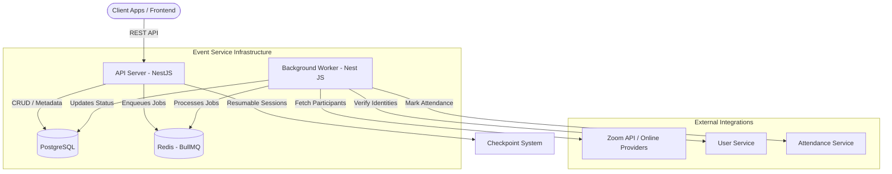

# Architecture

The Event Management Service is built using **NestJS** and follows a distributed architecture designed for scalability, especially for handling long-running background tasks like attendance synchronization.

## 🏗️ System Overview

The service operates in a **dual-process model**:

1.  **API Server**: Handles all incoming REST API requests, validation, and metadata management.
2.  **Background Worker**: Uses **BullMQ** to process intensive tasks (e.g., fetching thousands of participants from Zoom) without blocking the API.

### High-Level Architecture Diagram

## 🛠️ Key Components

### 1. API Server (Command: `npm run start:dev`)
Responsible for:
-   **Event Management**: Creating, updating, and deleting events and recurrence patterns.
-   **RBAC**: Enforcing role-based access control via `PermissionMiddleware`.
-   **Validation**: Ensuring data integrity using custom pipes (e.g., `DateValidationPipe`, `AttendeesValidationPipe`).

### 2. Background Worker (Command: `npm run start:worker:dev`)
The worker process listens to queues in **Redis** and handles:
-   **Attendance Syncing**: Fetching large participant lists from Zoom and mapping them to system users.
-   **Checkpointing**: Implementing resumability for long-running synchronization jobs.
-   **Report Generation**: Processing data for event-specific reports.

### 3. Data Layer
-   **PostgreSQL**: Stores relational data including `EventDetails`, `Events` (recurrence patterns), `EventRepetition` (individual instances), and `EventAttendees`.
-   **Redis**: Serves as the primary message broker for **BullMQ** and provides caching for high-frequency access.

### 4. Integration Adapters
The service uses a **Locator/Adapter pattern** for online meeting providers:
-   **Zoom Adapter**: Specifically handles the nuances of Zoom Meetings vs. Webinars.
-   **User Service**: Used to resolve usernames/emails to internal UUIDs.
-   **Attendance Service**: Acts as the centralized storage for all attendance records across the ecosystem.

## 🔄 Core Data Flows

### Attendance Synchronization Flow
1.  Admin triggers attendance marking for a completed event repetition.
2.  The **API** creates an `attendance_job` in PostgreSQL and enqueues it in **Redis**.
3.  A **Worker** picks up the job and calls the **Zoom Adapter**.
4.  The system iterates through Zoom participants, fetches mapping data from the **User Service**, and marks attendance in the **Attendance Service**.
5.  Progress is updated via the **Checkpoint System** to allow recovery from failures.
