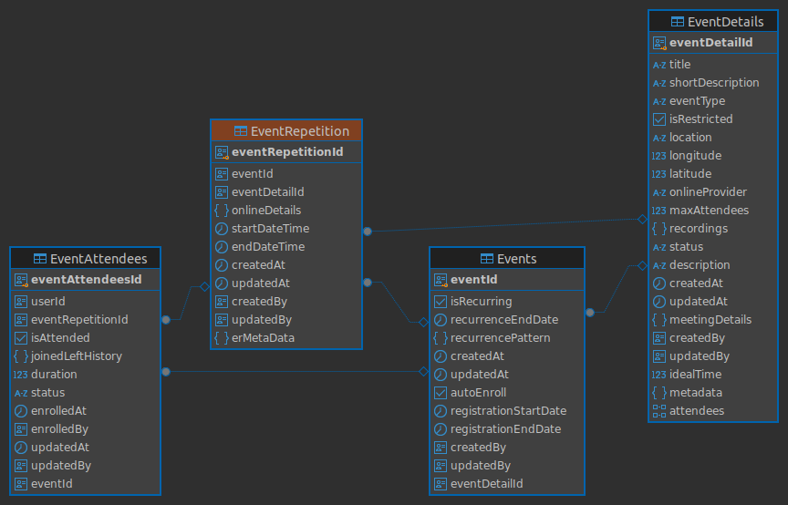

# Database Schema

## Entities -Event Management

### Table: Events

| Column Name           | Data Type                | Constraints                                       |
| --------------------- | ------------------------ | ------------------------------------------------- |
| eventId               | uuid                     | NOT NULL, DEFAULT gen_random_uuid(), PRIMARY KEY  |
| isRecurring           | boolean                  | NOT NULL, DEFAULT false                           |
| recurrenceEndDate     | timestamp with time zone |                                                   |
| recurrencePattern     | jsonb                    | NOT NULL                                          |
| createdAt             | timestamp with time zone | NOT NULL, DEFAULT now()                           |
| updatedAt             | timestamp with time zone | NOT NULL, DEFAULT now()                           |
| autoEnroll            | boolean                  | DEFAULT false                                     |
| registrationStartDate | timestamp with time zone |                                                   |
| registrationEndDate   | timestamp with time zone |                                                   |
| createdBy             | uuid                     |                                                   |
| updatedBy             | uuid                     |                                                   |
| eventDetailId         | uuid                     | FOREIGN KEY from "EventDetails" ("eventDetailId") |

### Table: EventDetails

| Column Name      | Data Type                | Constraints                                      |
| ---------------- | ------------------------ | ------------------------------------------------ |
| eventDetailId    | uuid                     | NOT NULL, DEFAULT gen_random_uuid(), PRIMARY KEY |
| title            | character varying        | NOT NULL                                         |
| shortDescription | character varying        | NOT NULL                                         |
| eventType        | character varying        | NOT NULL                                         |
| isRestricted     | boolean                  | NOT NULL, DEFAULT false                          |
| location         | character varying        |                                                  |
| longitude        | double precision         |                                                  |
| latitude         | double precision         |                                                  |
| onlineProvider   | character varying        |                                                  |
| maxAttendees     | integer                  | DEFAULT 0                                        |
| recordings       | jsonb                    |                                                  |
| status           | character varying        | NOT NULL                                         |
| description      | text                     | NOT NULL                                         |
| createdAt        | timestamp with time zone | NOT NULL, DEFAULT now()                          |
| updatedAt        | timestamp with time zone | NOT NULL, DEFAULT now()                          |
| meetingDetails   | jsonb                    |                                                  |
| createdBy        | uuid                     |                                                  |
| updatedBy        | uuid                     |                                                  |
| idealTime        | integer                  |                                                  |
| metadata         | jsonb                    |                                                  |
| attendees        | text[]                   |                                                  |

### Table: EventRepetition

| Column Name       | Data Type                | Constraints                                       |
| ----------------- | ------------------------ | ------------------------------------------------- |
| eventRepetitionId | uuid                     | NOT NULL, DEFAULT gen_random_uuid(), PRIMARY KEY  |
| eventId           | uuid                     | FOREIGN KEY from "Events" ("eventId")             |
| eventDetailId     | uuid                     | FOREIGN KEY from "EventDetails" ("eventDetailId") |
| onlineDetails     | jsonb                    |                                                   |
| startDateTime     | timestamp with time zone | DEFAULT timezone('utc'::text, now())              |
| endDateTime       | timestamp with time zone | DEFAULT timezone('utc'::text, now())              |
| createdAt         | timestamp with time zone | DEFAULT now()                                     |
| updatedAt         | timestamp with time zone | DEFAULT now()                                     |
| createdBy         | uuid                     |                                                   |
| updatedBy         | uuid                     |                                                   |
| erMetaData        | jsonb                    | DEFAULT '{}'::jsonb                               |

### Table: EventAttendees

| Column Name       | Data Type                | Constraints                                              |
| ----------------- | ------------------------ | -------------------------------------------------------- |
| eventAttendeesId  | uuid                     | NOT NULL, DEFAULT gen_random_uuid(), PRIMARY KEY         |
| userId            | uuid                     |                                                          |
| eventRepetitionId | uuid                     | FOREIGN KEY from "EventRepetition" ("eventRepetitionId") |
| isAttended        | boolean                  |                                                          |
| joinedLeftHistory | jsonb                    |                                                          |
| duration          | integer                  |                                                          |
| status            | character varying        |                                                          |
| enrolledAt        | timestamp with time zone |                                                          |
| enrolledBy        | uuid                     |                                                          |
| updatedAt         | timestamp with time zone |                                                          |
| updatedBy         | uuid                     |                                                          |
| eventId           | uuid                     | FOREIGN KEY from "Events" ("eventId")                    |

### Table: RolePermission

| Column Name      | Data Type                | Constraints                                              |
| ---------------- | ------------------------ | -------------------------------------------------------- |
| rolePermissionId | uuid                     | NOT NULL, DEFAULT gen_random_uuid(), PRIMARY KEY         |
| roleTitle        | character varying        | NOT NULL                                                 |
| module           | character varying        | NOT NULL                                                 |
| requestType      | character varying        | NOT NULL                                                 |
| apiPath          | character varying        | NOT NULL                                                 |
| createdBy        | uuid                     | NOT NULL                                                 |
| updatedBy        | uuid                     | NOT NULL                                                 |
| createdAt        | timestamp with time zone | DEFAULT now() NOT NULL                                   |
| updatedAt        | timestamp with time zone | DEFAULT now() NOT NULL                                   |

### Table: attendance_jobs

| Column Name         | Data Type                   | Constraints                                              |
| ------------------- | --------------------------- | -------------------------------------------------------- |
| id                  | uuid                        | NOT NULL, DEFAULT gen_random_uuid(), PRIMARY KEY         |
| job_id              | character varying(255)      | NOT NULL, UNIQUE                                         |
| event_repetition_id | uuid                        |                                                          |
| status              | character varying(50)       | NOT NULL, DEFAULT 'pending'                              |
| progress            | integer                     | NOT NULL, DEFAULT 0                                      |
| error_message       | text                        |                                                          |
| result              | jsonb                       |                                                          |
| started_at          | timestamp without time zone |                                                          |
| completed_at        | timestamp without time zone |                                                          |
| created_at          | timestamp without time zone | DEFAULT CURRENT_TIMESTAMP NOT NULL                       |
| updated_at          | timestamp without time zone | DEFAULT CURRENT_TIMESTAMP NOT NULL                       |
| contextType         | character varying(255)      |                                                          |

