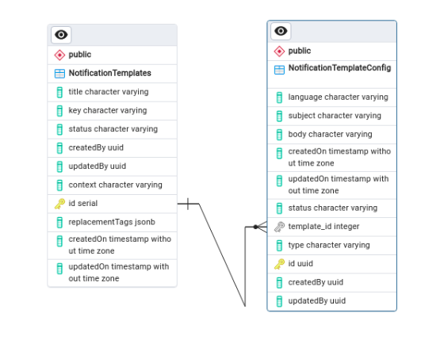
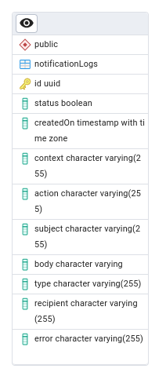

# Database Schema

### Entities ####
#### NotificationActionTemplates #### 

| Column Name       | Data Type          | Description                                                                       |
|-------------------|--------------------|-----------------------------------------------------------------------------------|
| id                | integer            | Unique identifier for the template                                                |
| title             | character varying  | Title of the notification template                                                |
| key               | character varying  | Key identifier for the template                                                   |
| status            | character varying  | Status of the template (e.g., active, inactive)                                   |
| createdBy         | uuid               | ID of the user who created the template                                           |
| updatedBy         | uuid               | ID of the user who last updated the template                                      |
| context           | character varying  | Context or purpose of the template                                                |
| replacementTags   | jsonb              | JSON data containing replacement tags for dynamic content in the template         |
| createdOn         | timestamp          | Timestamp for when the template was created                                       |
| updatedOn         | timestamp          | Timestamp for when the template was last updated                                  |

#### NotificationTemplateConfig ####

| Column Name       | Data Type          | Description                                                                       |
|-------------------|--------------------|-----------------------------------------------------------------------------------|
| id                | uuid               | Unique identifier for the configuration                                           |
| language          | character varying  | Language code for localization of the template                                    |
| subject           | character varying  | Subject line of the notification email/SMS                                        |
| body              | character varying  | Body/content of the notification email/SMS                                        |
| createdOn         | timestamp          | Timestamp for when the configuration was created                                  |
| updatedOn         | timestamp          | Timestamp for when the configuration was last updated                             |
| status            | character varying  | Status of the configuration (e.g., active, inactive)                              |
| template_id       | integer            | Foreign key referencing the NotificationTemplates table                           |
| type              | character varying  | Type of configuration (e.g., email, SMS)                                          |
| createdBy         | uuid               | ID of the user who created the configuration                                      |
| updatedBy         | uuid               | ID of the user who last updated the configuration                                 |

#### NotificationLogs ####

| Column Name | Data Type                | Description                                                                       |
|-------------|--------------------------|-----------------------------------------------------------------------------------|
| id          | uuid                     | Unique identifier (Primary Key)                                                   |
| status      | boolean                  | Status of the notification                                                        |
| createdOn   | timestamp with time zone | Timestamp when the record was created                                             |
| context     | character varying(255)   | Context of the notification                                                       |
| action      | character varying(255)   | Action associated with the notification                                           |
| subject     | character varying(255)   | Subject of the notification                                                       |
| body        | character varying(255)   | Body content of the notification                                                  |
| type        | character varying(255)   | Type of notification                                                              |
| recipient   | character varying(255)   | Recipient of the notification                                                     |
| error       | character varying(255)   | Error message, if any                                                             |

