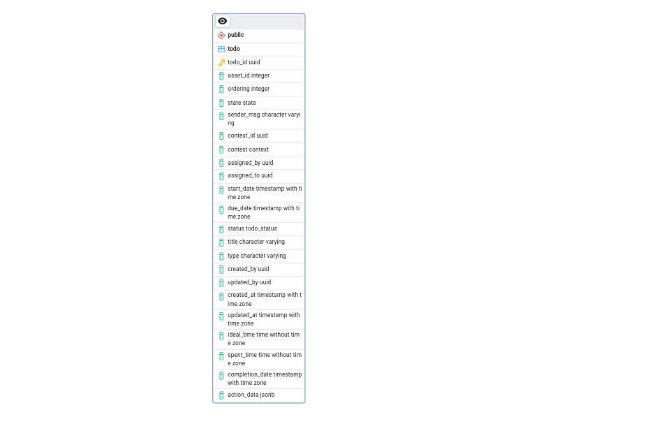

# Database Schema

## Entities -Todo Management

### Table: Todo

| Column Name     | Data Type                | Description                                            |
| --------------- | ------------------------ | ------------------------------------------------------ |
| todo_id         | uuid                     | Unique identifier for each todo task.                  |
| asset_id        | integer                  | ID of the related asset (optional).                    |
| ordering        | integer                  | Defines the order of tasks (defaults to 1).            |
| state           | state                    | Current state of the todo (custom enum type).          |
| sender_msg      | character varying        | Message sent by the assigner to the assignee.          |
| context_id      | uuid                     | ID representing the context related to the task.       |
| context         | context                  | Context of the task (custom enum type).                |
| assigned_by     | uuid                     | User ID of the person assigning the task.              |
| assigned_to     | uuid                     | User ID of the person to whom the task is assigned.    |
| start_date      | timestamp with time zone | When the task should start.                            |
| due_date        | timestamp with time zone | Deadline by which the task should be completed.        |
| status          | todo_status              | Current status of the task (incomplete by default).    |
| title           | character varying        | Title or summary of the task.                          |
| type            | character varying        | Type of task, describing its nature (e.g., assign).    |
| created_by      | uuid                     | User ID of the task creator.                           |
| updated_by      | uuid                     | User ID of the person who last updated the task.       |
| created_at      | timestamp with time zone | When the task was created.                             |
| updated_at      | timestamp with time zone | Last update timestamp of the task.                     |
| ideal_time      | time without time zone   | Ideal time expected for task completion.               |
| spent_time      | time without time zone   | Actual time spent on the task.                         |
| completion_date | timestamp with time zone | When the task was marked as completed (if applicable). |
| action_data     | jsonb                    | Additional data related to the task in JSON format.    |

